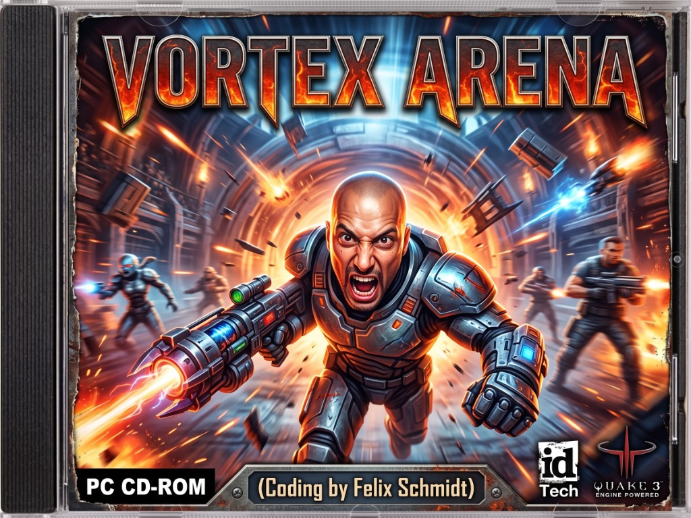

# Vortex Arena 🌀
### Ultimate 3D WebGL Arena FPS Experience



[]()
[-brightgreen.svg)]()
[](LICENSE)
[-orange.svg)]()
[]()
[](https://enzocage.github.io/VORTEX-ARENA/)

> **Vortex Arena** ist ein rasanter, vollwertiger 3D-Retro-Arena-Ego-Shooter im Browser, inspiriert von den legendären Arena-FPS-Klassikern der späten 90er und frühen 2000er Jahre (*Quake III Arena*, *Unreal Tournament*). Das Spiel wurde von Grund auf in **reinem HTML5, WebGL (Three.js) und der Web Audio API** entwickelt – 100 % autark, ohne Build-Tools, ohne Node.js-Server und ohne externe Runtime-Frameworks.

---

## 📑 Inhaltsverzeichnis
1. [Spielfunktionen im Überblick](#-spielfunktionen-im-überblick)
2. [Echte VQ3 / CPM Movement-Physik (`pmove`)](#-echte-vq3--cpm-movement-physik-pmove)
3. [Das 7-Waffen-Arsenal & Schadenswerte](#-das-7-waffen-arsenal--schadenswerte)
4. [Audiovisuelle Effekte & Mündungsfeuer-Beleuchtung](#-audiovisuelle-effekte--mündungsfeuer-beleuchtung)
5. [Die 9 Aufsteigenden Arenen](#-die-9-aufsteigenden-arenen)
6. [Hochentwickelte Bot-KI & Kampftaktik](#-hochentwickelte-bot-ki--kampftaktik)
7. [Integrierter 3D In-Game Level-Editor (Taste `E`)](#-integrierter-3d-in-game-level-editor-taste-e)
8. [Audio-Synthese, WaveShaper-Distortion & Soundtrack](#-audio-synthese-waveshaper-distortion--soundtrack)
9. [120 FPS High-Refresh Engine-Optimierung (Intel Arc 140V & iGPUs)](#-120-fps-high-refresh-engine-optimierung)
10. [🎮 Vollständige Steuerung](#-vollständige-steuerung)
11. [🚀 Schnellstart & Installation](#-schnellstart--installation)
12. [⚙️ Grafikpresets & Performance-Tuning](#-grafikpresets--performance-tuning)
13. [👥 Credits & Team](#-credits--team)
14. [📜 Lizenz & Urheberrecht](#-lizenz--urheberrechtshinweis)

---

## ⚡ Spielfunktionen im Überblick

* **Zero Dependencies Architecture**: Pures Vanilla JavaScript mit Three.js r128. Keine Paketmanager, kein Webpack, kein Vite oder npm notwendig – einfach Browser öffnen und spielen.
* **Authentische Physikschleife**: Echtes Strafe-Jumping, Bunny-Hopping, Rocket-Jumping und Wasserwiderstand.
* **Sichtbare 3D-Viewmodels**: Jede Waffe wird vor dem Spieler mit prozeduralem Rückstoß, Waffen-Bobbing und Mündungsfeuer animiert gerendert.
* **Dynamische Echtzeit-Schockwellen**: 3D-Schockwellenringe bei Explosionen, fliegende glühende Trümmerteile, Partikelspritzer und persistente Decals.
* **Adaptiver Schwierigkeitsgrad**: Auswahl zwischen **Leicht**, **Mittel** und **Schwer** direkt im Hauptmenü.
* **Automatisches Vorwärtsgehen**: Bequemer Auto-Walk per Taste **`C`** oder **`NumLock`** für entspanntes Erkunden und Navigieren.
* **Integrierter 3D Level-Editor**: Beliebige Blöcke, Jump-Pads, Waffen, Items und Spawns direkt in der laufenden 3D-Szene setzen und als JSON exportieren.
* **High-Octane Soundtrack**: Dauerhafter, mitreißender Arena-Track von **Venjent**, der nahtlos über Level- und Match-Respawns hinweg loopt.

---

## 🏃 Echte VQ3 / CPM Movement-Physik (`pmove`)

Das Bewegungsgefühl von Arena-Shootern steht und fällt mit der mathematischen Exaktheit des Vektor-Beschleunigungsmodells. Vortex Arena implementiert die originale Quake-3-Physikformel:

$$\vec{v}_{\text{neu}} = \vec{v} + \text{accel} \cdot \Delta t \cdot \text{wishspeed} \cdot \vec{w}$$

### Strafe-Jumping & Speedometer (UPS)
* **Bodenreibung (`friction = 6.0`)**: Sobald der Spieler den Boden berührt, greift Bodenreibung. Wer jedoch im perfekten Rhythmus springt (Bunny-Hopping), verhindert den Reibungsverlust.
* **Luftbeschleunigung (`airAccel = 2.5`)**: Wenn der Spieler schräg vorwärts läuft (`W` + `A` oder `W` + `D`) und gleichzeitig die Maus sanft in Sprungrichtung mitzieht, steht der Richtungsvektor senkrecht zur Bewegungsrichtung. Dadurch entsteht stetige Beschleunigung weit über das normale Lauflimit hinaus.
* **Live Speedometer**: Das HUD misst in Echtzeit die horizontale Geschwindigkeit und rechnet sie in klassische Quake-Units pro Sekunde um:
  - **Normaler Laufschritt**: ~320 UPS
  - **Erster Strafe-Jump**: ~450 UPS
  - **Perfekte Sprungkette**: 650 bis 800+ UPS!

### Vertikale Katapulte & Rocket-Jumping
* **Rocket-Jumping**: Durch Abfeuern einer Rakete direkt vor die eigenen Füße in Kombination mit einem synchronen Sprung (`Space`) addiert sich der Explosionsimpuls zur Vertikalgeschwindigkeit, wodurch gigantische Höhen und Abkürzungen erreichbar werden.
* **Flüssigkeits- & Schwimmmechanik**: Sobald der Spieler in Wasser oder Säure eintaucht, sinkt die Schwerkraft drastisch (`waterGravity = 6.0`), die Viskosität bremst abrupte Bewegungen (`waterFriction = 3.5`) und Halten der Leertaste lässt den Charakter realistisch an die Oberfläche auftauchen.
* **Jump-Pads & Beschleuniger**: Präzise berechnete ballistische Flugparabeln für sofortigen Höhentransport.

---

## 💥 Das 7-Waffen-Arsenal & Schadenswerte

Jede Waffe in Vortex Arena hat eine unverwechselbare ballistische Signatur, ein eigenes 3D-Viewmodel mit dynamischem Mündungsfeuer und maßgeschneiderte Soundeffekte:

| # | Waffe | Typ | Schaden | Feuerrate | Reichweite / Speed | Besonderheiten & Taktik |
| :---: | :--- | :---: | :---: | :---: | :---: | :--- |
| **1** | **Circular Saw (SAW)** | Nahkampf | 50 HP | 0.40 s | 2.5 m | Rotierende Sägezähne für Demütigungen (*Humiliation!*). Unendliche Munition. |
| **2** | **Machinegun (MG)** | Hitscan | 7 HP | 0.10 s | 200 m | Präzises Dauerfeuer mit Streuung. Exzellent zum Finishen flüchtender Gegner. |
| **3** | **Combat Shotgun (SG)** | Hitscan | 110 HP (11x10) | 1.00 s | 150 m | 11 Pellets im Streufächer. Tödlich im extremen Nahkampf; spürbarer Kameraschüttler. |
| **4** | **Rocket Launcher (RL)** | Projektil | 100 HP (+Splash) | 0.80 s | 38 m/s | 5.5 m Explosionsradius. Ermöglicht Rocket-Jumps; glühende Triebwerksflamme & Rauch. |
| **5** | **Railgun (RG)** | Hitscan | 100 HP | 1.50 s | 300 m | Scharfschützen-Laser mit leuchtender Cyan-Doppelhelix. 2 Treffer in Folge = *Impressive!* |
| **6** | **Plasma Rifle (PG)** | Projektil | 20 HP (+Splash) | 0.12 s | 50 m/s | Grelle Ionen-Kugeln mit hoher Kadenz. Ideal zum Blockieren enger Gänge. |
| **7** | **Vortex BFG (BFG)** | Projektil | 150 HP (+Splash) | 1.20 s | 28 m/s | 9.0 m Verheerungsradius. Gigantische Energiekugel mit gewaltiger Schockwelle. |

> **Quad Damage Multiplikator**: Mit aktiviertem Quad-Damage-Powerup wird der Schaden aller Waffen um den Faktor **3.0x** verstärkt (z. B. 300 Schaden mit der Railgun oder 450 Schaden mit der BFG!).

---

## 🎆 Audiovisuelle Effekte & Mündungsfeuer-Beleuchtung

Das Kampffeedback wurde grundlegend überarbeitet, um jeden Schusswechsel maximal spürbar und kinetisch zu machen:

1. **Dynamische Echtzeit-Punktlichter**:
   - Beim Feuern wird nicht nur das Viewmodel beleuchtet, sondern ein synchroner `PointLight`-Blitz in der Spielwelt erzeugt (bis zu 12.0 Intensität und 32 Meter Radius).
   - Farbcodierung: Cyan für Railgun, Violett für Plasma, Giftgrün für BFG, Flammendes Orange für Raketen und Gold für Schrotflinte.
2. **Animierte 3D-Schockwellenringe**:
   - Detonationen von Raketen und BFG erzeugen kreisförmige `RingGeometry`-Stoßwellen, die sich mit hoher Geschwindigkeit über Böden und Wände ausbreiten und nach außen hin verblassen.
3. **Kameraerschütterung (Screen Shake)**:
   - Einschläge in der Nähe des Spielers lösen ein abklingendes 3D-Erdbeben-Jittering aus, das sowohl Translation als auch Roll- und Neigungswinkel der Kamera dynamisch stimuliert.
4. **Pop-Hitmarker & Treffer-Rückmeldung**:
   - Bei jedem erfolgreichen Treffer flammt ein glühend rotes Kreuz mit doppelter Kontur und Skalierungs-Burst (`scale(1.35)`) im Fadenkreuz auf, untermalt vom klassischen "Ding"-Chime.
5. **Gleißende Partikelschauer**:
   - Dichte Blutspritzer bei Fleischtreffern, abprallende Querschläger-Funken an Steinwänden und persistente rauchende Decal-Krater.

---

## 🏛️ Die 9 Aufsteigenden Arenen

Die 9 Kampfarenen wurden für unterschiedliche Spielstile und Gefechtssituationen maßgeschneidert:

```
[1. The Courtyard]  -->  [2. Gothic Temple]   -->  [3. The Longest Yard]
       │                         │                         │
[4. Brimstone Core] -->  [5. Crypt of Damned] -->  [6. Space Chamber]
       │                         │                         │
[7. The Iron Citadel]--> [8. Void Sanctuary]  -->  [9. The Final Altar]
```

1. **The Courtyard**: Symmetrischer, gotischer Steinhof mit weiten Säulenreihen, zwei erhöhten Scharfschützenbalkonen und zentralem Raketenwerfer-Sockel. Perfekt zum Erlernen von Strafe-Jumps.
2. **Gothic Temple**: Düstere zweistöckige Kathedrale mit 4 parabelförmigen Jump-Pads, MegaHealth auf dem Hochbalkon und einem kochenden Lavagraben im Untergeschoss.
3. **The Longest Yard**: Die legendäre Weltraum-Plattform schwebend über dem endlosen Sternenabgrund. Hochgeschwindigkeits-Katapulte schleudern den Spieler quer durchs All.
4. **Brimstone Core**: Ein gewaltiger Industrie-Vulkanreaktor über einem 80x80 Meter großen Magmameer mit 4 befestigten Eckbastionen, Hängebrücken und Quad-Damage im Zentrum.
5. **Crypt of the Damned**: Verschlungene Katakomben mit zwei tief überfluteten Wasserflügeln, realistischer Schwimmphysik und engen Tunneln für Nahkampfgefechte.
6. **Space Chamber**: Orbitale Forschungsstation mit Rundlauf-Teleportern, vier schwebenden Satelliten-Waffenplattformen und einem 22 Meter hohen Orbitalschrein.
7. **The Iron Citadel**: Kolossale, 3-stufige Eisenfestung (80x80m) mit vier 25 Meter hohen Wachtürmen, Vertikalliften und labyrinthartigen Wehrgängen.
8. **The Void Sanctuary**: Achteckige Weltraum-Ringarena um ein bodenloses schwarzes Loch im Zentrum, schwebendem Quad Damage und exponierten Außenfelsen.
9. **The Final Altar**: Monumentale Boss-Arena gegen Arena-Champion Xaero mit erhabenem Thronsaal, Säulenkreisen und einem epischen 50-Frag-Showdown.

---

## 🤖 Hochentwickelte Bot-KI & Kampftaktik

Die künstliche Intelligenz von Vortex Arena simuliert menschliches Spielverhalten auf kompetitivem Niveau:

* **Predictive Lead Aiming (Vorhalte-Zielen)**: Bots berechnen den Geschwindigkeitsvektor des Spielers und schießen bei langsameren Projektilen (Raketen, Plasma, BFG) vorausschauend in den prognostizierten Laufweg.
* **Kreis-Strafing & Ausweichsprünge**: In direkten Feuergefechten bewegen sich Bots nicht linear, sondern umkreisen den Gegner mit rhythmischen Sprungmanövern.
* **Taktisches Item-Routen & Rückzug**: Sinkt die Gesundheit eines Bots unter 35 HP, bricht er den Angriff ab, nutzt Deckung und steuert gezielt die nächstgelegenen Medipacks oder Rüstungen an.
* **Schwierigkeitsstufen**:
  - **Leicht**: Höhere Reaktionszeiten der Bots, verringerte Zielgenauigkeit, Spieler startet mit 150 HP und 100 Rüstung.
  - **Mittel**: Ausgewogenes Turnierniveau mit solider Zielgenauigkeit und Standard-Ausrüstung.
  - **Schwer**: Unbarmherzige Scharfschützen-Reflexe, sofortige Reaktion auf Sichtkontakt und aggressives Item-Denying.

---

## 🛠️ Integrierter 3D In-Game Level-Editor (Taste `E`)

Vortex Arena enthält einen voll funktionsfähigen 3D-Level-Editor, der direkt im Spiel läuft:

* **Nahtloses Umschalten**: Drücke jederzeit im Spiel die Taste **`E`**, um zwischen der Spielfigur und dem Editor-Kameramodus zu wechseln.
* **Raycast-Platzierung mit Raster-Snap**: Platziere Objekte mit pixelgenauer Präzision auf einem einstellbaren 1m-, 2m- oder 4m-Raster.
* **Verfügbare Bautypen**:
  - Solide Strukturblöcke (2x2x2) mit Stein-, Metall- oder Ziegeltexturen
  - Funktionale Jump-Pads mit definiertem Impulsvektor
  - Zweiweg-Teleporter-Portale
  - Waffen-Pickups (RL, RG, SG, PG, BFG)
  - Medipacks (25 HP, 50 HP, MegaHealth) & Rüstungen (50 AP, 100 Heavy Armor)
  - Quad Damage Powerup
  - Dynamische Spieler- und Bot-Spawnpunkte
* **Löschmodus**: Ein Rechtsklick auf einen platzierten Block entfernt ihn augenblicklich.
* **JSON Export & Import**: Eigene Map-Kreationen können mit einem Klick als strukturierte `.json`-Datei auf der Festplatte gespeichert oder importiert werden.

---

## 🔊 Audio-Synthese, WaveShaper-Distortion & Soundtrack

Das gesamte Sounddesign von Vortex Arena basiert auf einer autarken Web-Audio-Architektur:

### Die Audio-Pipeline
```
[ Synthesized SFX ] ──► [ WaveShaper Overdrive ] ──► [ Fast Limiting Compressor ] ──► [ Master Gain ] ──► Destination
[ Voice Announcer ] ─────────────────────────────► [ Fast Limiting Compressor ] ─────────────▲
[ Venjent Music ]   ─────────────────────────────► [ Fast Limiting Compressor ] ─────────────┘
```

* **WaveShaper-Overdrive**: Erzeugt die typische, dreckige analoge Sättigung von 90er-Jahre-Soundchips für dröhnende Explosionen und kreischende Sägen.
* **Hard-Limiting Kompressor (`threshold: -12dB, ratio: 10, attack: 0.002s`)**: Verhindert digitales Übersteuern und verleiht Mündungsfeuer und Detonationen massiven akustischen Druck.
* **Prozedurale Sounds**:
  - **Explosionen**: Zweischichtiger Tiefbass-Sub-Thump (180 Hz &rarr; 22 Hz) kombiniert mit fauchendem Feuerball-Bandpass.
  - **Railgun**: Tödlicher Peitschenknall (3400 Hz &rarr; 90 Hz Sägezahn) mit 680-Hz-Resonanzschweif.
  - **Shotgun**: Schweres Doppellauf-Krachen mit Schrot-Streurauschen.
  - **Maschinengewehr**: Scharfkantiges Mündungsfeuer-Burst mit 240-Hz-Sawtooth-Kick.
* **Original Arena-Soundtrack**: Der treibende Drum-and-Bass-/Breakbeat-Track von **Venjent** (`usysqd.mp3`) läuft als nahtlose Endlosschleife, die bei Spielertod oder Respawn niemals unterbricht.

---

## 🚀 120 FPS High-Refresh Engine-Optimierung

Vortex Arena wurde gezielt auf ultra-hohe Bildraten (120+ FPS bei 8,3 ms Frametime) optimiert, insbesondere für moderne integrierte Grafikprozessoren wie die **Intel Arc 140V**:

1. **Zero-GC Physikschleife**:
   - Die gesamte Hauptphysikschleife arbeitet ohne `new THREE.Vector3()` Allokationen. Vektoren (`_wishDir`, `_axisY`, `_moveStep`) werden wiederverwendet, wodurch Garbage-Collection-Ruckler vollständig eliminiert werden.
2. **Geometrie- & Material-Pooling**:
   - Partikel, Schockwellenringe und Einschuss-Decals teilen sich instanzierte Puffer-Geometrien (`_boxGeomSmall`, `_boxGeomTiny`, `_ringGeom`, `_decalGeom`).
3. **Intelligentes HUD- & Textur-Throttling**:
   - Das animierte Sarge-Face-Canvas rendert mit 30 FPS, während die WebGL-3D-Welt mit 120 FPS läuft.
4. **Pixel-Ratio Locking**:
   - Im Modus *Ultra-Performance* wird die Renderauflösung auf natives 1:1 gelockt, um 4-fache Shader-Overheads auf High-DPI-/4K-Bildschirmen zu vermeiden.

---

## 🎮 Vollständige Steuerung

| Taste / Eingabe | Funktion | Details |
| :--- | :--- | :--- |
| **W, A, S, D** / **Pfeile** | Fortbewegung | Vorwärts, Seitwärts, Rückwärts (**`S` stoppt auch Auto-Walk**) |
| **Taste C** / **NumLock** | **Auto-Walk (Gehen)** | Schaltet automatisches Vorwärtsgehen ein / aus (mit HUD-Anzeige) |
| **Maus** | Umschauen / Zielen | Pointer Lock Modus für präzises FPS-Zielen |
| **Linke Maustaste** | Waffe abfeuern | Kontinuierliches Schnellfeuer durch Gedrückthalten |
| **Leertaste** | Springen & Schwimmen | Strafe-Jumps am Boden / Auftauchen unter Wasser |
| **Ziffern 1 bis 7** | Waffe direkt wählen | 1: SAW, 2: MG, 3: SG, 4: RL, 5: RG, 6: PG, 7: BFG |
| **Mausrad** | Waffen durchschalten | Schnelles Waffenwechseln im Gefecht |
| **Taste E** | 3D Level-Editor | Umschalten zwischen Spiel- und Editor-Modus |
| **Taste O** | Optionen & Settings | Stufenloser FOV-Slider (70°–120°), Sensitivität, Audio, Fadenkreuz |
| **TAB-Taste** | Scoreboard | Live-Tabelle mit Frags, Deaths, Rang und Bot-Status |
| **Rechtsklick im Editor** | Block löschen | Entfernt den anvisierten Block im Editor-Modus |

---

## 🚀 Schnellstart & Installation

### Option 1: Sofort im Browser spielen (Online)
Besuche die offizielle GitHub Pages Deployment-Seite:
👉 **[https://enzocage.github.io/VORTEX-ARENA/](https://enzocage.github.io/VORTEX-ARENA/)**

### Option 2: 100% Offline Lokal (Doppelklick)
Da alle Bibliotheken (Three.js r128) lokal im Verzeichnis `lib/` liegen, kann das Spiel komplett ohne Internetverbindung gestartet werden:
1. Repository klonen oder als ZIP herunterladen:
   ```bash
   git clone https://github.com/enzocage/VORTEX-ARENA.git
   ```
2. Datei `index.html` einfach per Doppelklick im Webbrowser (**Chrome, Edge, Firefox, Brave**) öffnen.

### Option 3: Lokaler Webserver via PowerShell (Windows)
```powershell
cd VORTEX-ARENA
.\run_game.ps1
```
*Startet einen internen HTTP-Server auf Port 8080 und öffnet das Spiel automatisch.*

---

## ⚙️ Grafikpresets & Performance-Tuning

Über das Einstellungsmenü (**Taste `O`**) können folgende Parameter angepasst werden:

* **Sichtfeld (FOV)**: Stufenlos von **70°** (Cinematic) bis **120°** (Quake Pro Fisheye).
* **Mausempfindlichkeit**: Präzise Skalierung für High-DPI-Gaming-Mäuse.
* **Grafikqualität**:
  - **Ultra Performance (120 FPS)**: `pixelRatio = 1.0`, Schatten deaktiviert, optimiert für Intel Arc 140V & Laptops.
  - **Balanced (Ausgewogen)**: `pixelRatio = 1.25`, Standard-Beleuchtung.
  - **High Quality**: `pixelRatio = 1.5`, weiche dynamische Schatten aktiviert.
* **Fadenkreuz-Customizer**: Wechsel zwischen Kreuz (`cross`), Punkt (`dot`) und Kreis (`circle`) mit anpassbarer Farbe.

---

## 👥 Credits & Team

* **Coding, Architecture & Game Design**: **Felix Schmidt**
* **Soundtrack / Music**: **Venjent** (*High-Energy In-Game Loop Track: [usysqd.mp3](https://files.catbox.moe/usysqd.mp3)*)
* **Visual Artwork & Cover**: **Felix Schmidt & AI Generative Art**

---

## 📜 Lizenz & Urheberrechtshinweis

Dieses Projekt ist unter der **MIT-Lizenz** lizenziert – freie Nutzung, Modifikation, Vervielfältigung und Weitergabe gestattet.

*Alle Grafiken, Shader, 3D-Geometrien, Texturen, Audio-Synthesen und Soundeffekte wurden prozedural bzw. eigenständig ohne urheberrechtlich geschützte Originaldateien Dritter erstellt. "Vortex Arena" ist eine eigenständige Hommage an klassische Arena-Ego-Shooter.*
